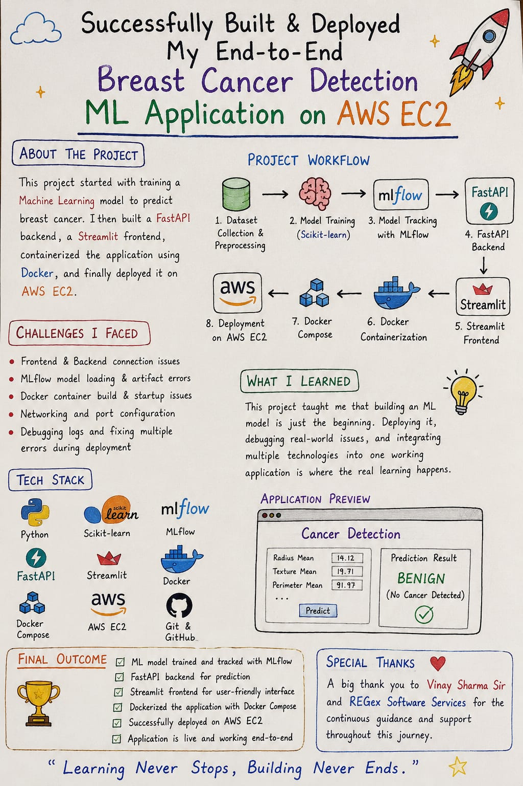

# End-to-End Breast Cancer Detection using Machine Learning

<p align="center">
  
</p>

An end-to-end Machine Learning project that predicts whether a breast tumor is **Benign (B)** or **Malignant (M)** using the Breast Cancer Wisconsin Dataset.

The project demonstrates the complete workflow from data preprocessing and model training to model comparison, experiment tracking with MLflow, API development using FastAPI, frontend development with Streamlit, Docker containerization, and deployment on AWS EC2.

---

## Features

- Data preprocessing pipeline
- Training and comparison of multiple Machine Learning models
- Selection of the best-performing model
- MLflow experiment tracking and model management
- FastAPI REST API for predictions
- Interactive Streamlit web application
- Dockerized backend and frontend
- Multi-container deployment using Docker Compose
- Deployment on AWS EC2

---

## Tech Stack

- Python 
- Scikit-learn
- Pandas
- NumPy 
- Machine Learning
- MLflow 
- FastAPI 
- Streamlit
- Docker
- Docker Compose
- AWS EC2 
- Git & GitHub |


## Project Workflow

```text
Dataset
      │
      ▼
Data Preprocessing
      │
      ▼
Train Multiple Models
      │
      ▼
Model Evaluation
      │
      ▼
Best Model Selection
      │
      ▼
MLflow Model Tracking
      │
      ▼
FastAPI Backend
      │
      ▼
Streamlit Frontend
      │
      ▼
Docker
      │
      ▼
AWS EC2 Deployment
```

---

##  Project Structure

```text
Cancer-Detection-Project/
│
├── data/
├── datapreprocessing/
├── images/
├── mlruns/
├── models/
├── notebooks/
├── src/
├── tests/
│
├── Dockerfile.backend
├── Dockerfile.frontend
├── docker-compose.yaml
├── frontend.py
├── main.py
├── requirements.txt
├── mlflow.db
└── README.md
```

---

## Installation

Clone the repository

```bash
git clone https://github.com/Chandraprakash-prajapat/Cancer-Detection-Project.git
```

Move into the project directory

```bash
cd Cancer-Detection-Project
```

(Optional) Create a virtual environment

```bash
python -m venv .venv
```

Activate the virtual environment

Windows

```bash
.venv\Scripts\activate
```

Linux / macOS

```bash
source .venv/bin/activate
```

Install the required dependencies

```bash
pip install -r requirements.txt
```

---

## Run Locally

### Start the FastAPI Backend

```bash
uvicorn main:app --reload
```

### Start the Streamlit Frontend

```bash
streamlit run frontend.py
```

Frontend

```
http://localhost:8501
```

Backend API Documentation

```
http://localhost:8000/docs
```

---

## Run with Docker

Build and start the application

```bash
docker compose up --build -d
```

Check running containers

```bash
docker ps
```

View logs

```bash
docker compose logs -f
```

Stop the application

```bash
docker compose down
```

---

## AWS EC2 Deployment

The application is deployed on an AWS EC2 instance using Docker and Docker Compose.

Deployment steps:

- Launch an EC2 instance
- Configure Security Groups
- Connect using SSH
- Clone the GitHub repository
- Install Docker and Docker Compose
- Build Docker images
- Run containers using Docker Compose
- Access the application using the EC2 Public IP

---

## What I Learned

- Building an end-to-end Machine Learning application
- Data preprocessing and feature preparation
- Training and comparing multiple Machine Learning models
- Selecting the best-performing model
- Tracking experiments using MLflow
- Building REST APIs with FastAPI
- Developing interactive applications using Streamlit
- Containerizing applications with Docker
- Managing multiple containers using Docker Compose
- Deploying applications on AWS EC2
- Debugging deployment issues
- Using Git and GitHub for version control

---

## Future Improvements

- Improve the user interface
- Display prediction confidence score
- Add input validation
- Integrate model monitoring
- Deploy with a custom domain and HTTPS
- Automate deployment using GitHub Actions (CI/CD)

---

## Author

**Chandraprakash Prajapat**

GitHub: https://github.com/Chandraprakash-prajapat

LinkedIn: *https://www.linkedin.com/in/chandraprakashprajapat *

---

If you have any suggestions or ideas for improvement, i would be happy to hear them. 
